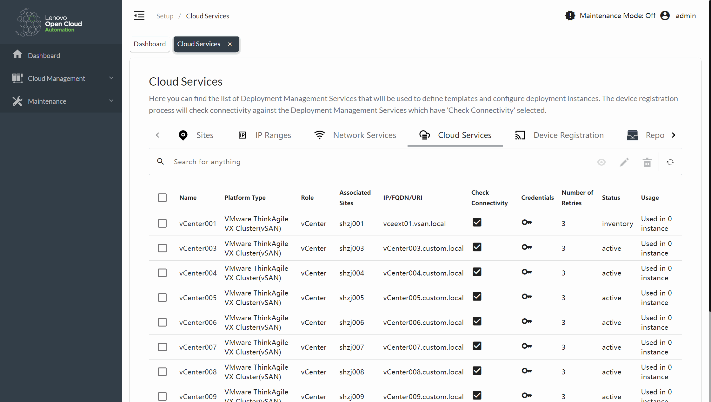
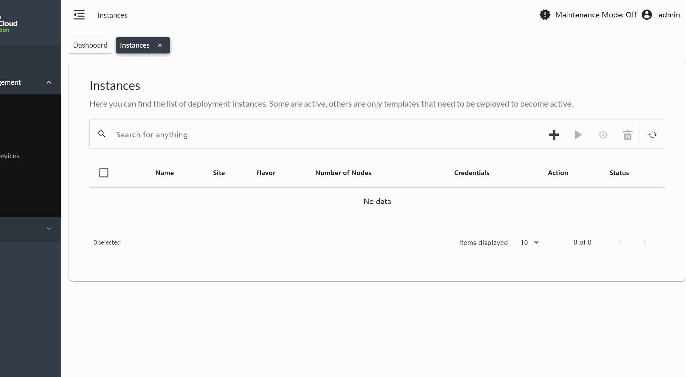
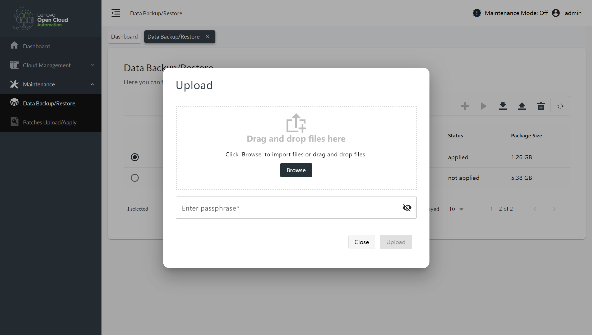
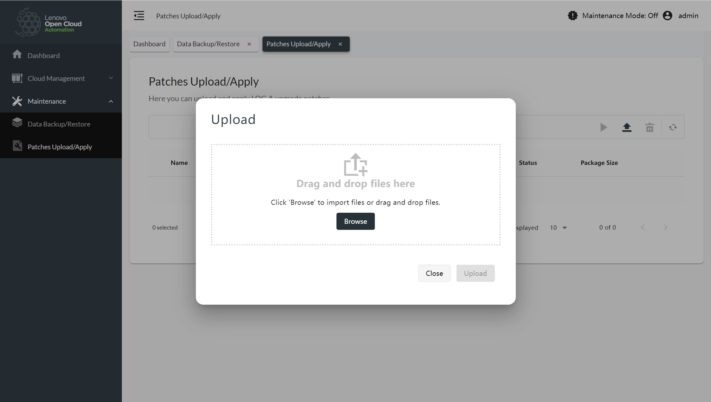

---
# You can also start simply with 'default'
theme: seriph
# random image from a curated Unsplash collection by Anthony
# like them? see https://unsplash.com/collections/94734566/slidev
background: https://cover.sli.dev
# some information about your slides (markdown enabled)
title: Slide

# apply unocss classes to the current slide
class: text-center
# https://sli.dev/features/drawing
drawings:
  persist: false
# slide transition: https://sli.dev/guide/animations.html#slide-transitions
transition: slide-left
# enable MDC Syntax: https://sli.dev/features/mdc
mdc: true
---

# 实习生答辩
蒋淼涛
Lenovo

---
transition: fade-out
---

# 实习期间的主要贡献

- ## 前端优化与性能提升
- ## 用户界面改进与用户体验优化
- ## 功能开发与问题解决
- ## 质量保证与测试
- ## 技术探索与创新

---
transition: fade-out
---

# 前端优化与性能提升
- 实现了页面缓存机制,显著提升了应用响应速度和用户体验。

---
transition: fade-out
---

# 前端优化与性能提升
- 重构了导航系统,增加了标签式导航功能。

---
transition: fade-out
---

# 前端优化与性能提升
- 设计并实现了路由服务来生成门户菜单项,提高了代码的可维护性和扩展性
<<< @/snippets/external.ts {*}{maxHeight:'350px'}

---
transition: fade-out
---

# 用户界面改进与用户体验优化
- 统一并优化了空值显示逻辑,将"Not Available"替换为"-"。

- 为关键操作(如创建新用户)添加了toast通知,增强了用户操作的反馈。

- 实现了页面切换动画和导航标签卡的创建/删除动画,提升了界面的现代感和用户友好度。

---
transition: fade-out
---

# 功能开发与问题解决
- 完成了上传和导出页面的实现。
- 解决了多个与用户界面相关的bug,如修复了Azure Stack HCI类型包创建向导中的提示信息问题。
- 改进了元数据备份包创建过程中的用户提示,优化了操作流程。

---
transition: fade-out
---

# 质量保证与测试
- 为导航标签组件和维护数据备份/补丁应用页面编写了单元测试用例。

- 多次验证修复后的功能,确保问题得到彻底解决。
---
transition: fade-out
---

# 技术探索与创新
1. 技术选型与实现:

- 基于WebSocket协议实现了富文本编辑器的实时协同编辑功能
- 选用了先进的CRDT算法,使用Yjs和Hocuspocus等成熟库来实现协同编辑的核心逻辑

2. 系统设计与集成:

- 设计并实现了完整的协同编辑系统,包括前端编辑器、WebSocket服务、数据持久化等
- 成功将协同编辑功能集成到现有的Next.js项目中,并解决了各种集成问题

3. 数据处理:

- 实现了Yjs文档数据的二进制存储和JSON格式转换
- 设计了合理的数据模型,解决了历史数据迁移的问题

4. 用户体验优化:

- 实现了实时光标同步、用户在线状态显示等增强协同体验的功能
- 优化了编辑状态的UI显示,提升了用户体验
---
transition: fade-out
---

# 总结

1. 问题解决能力:面对复杂的技术挑战,能够深入研究并找出解决方案。

2. 用户体验:对细节的关注和对用户体验的重视。

3. 质量意识:重视代码质量,主动编写测试用例并参与功能验证。

4. 学习能力:能够快速掌握新技术并应用到实际项目中,如Angular路由和动画效果的实现。

